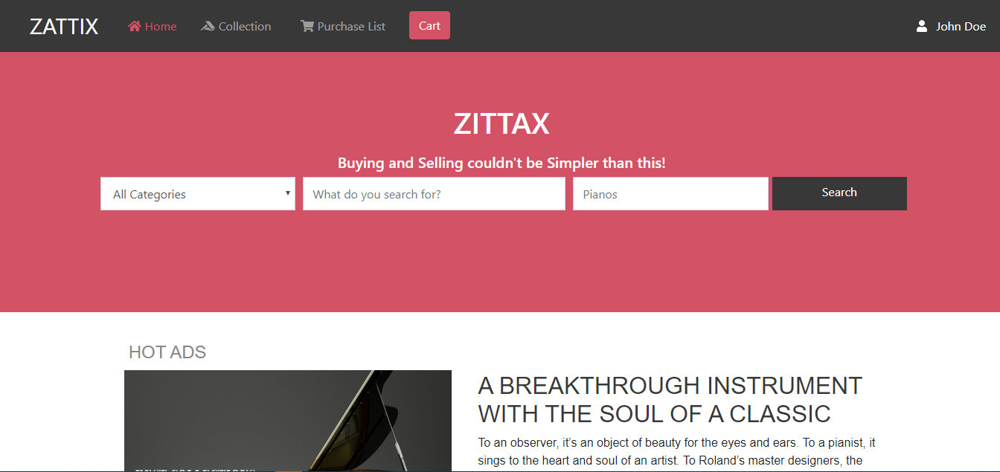
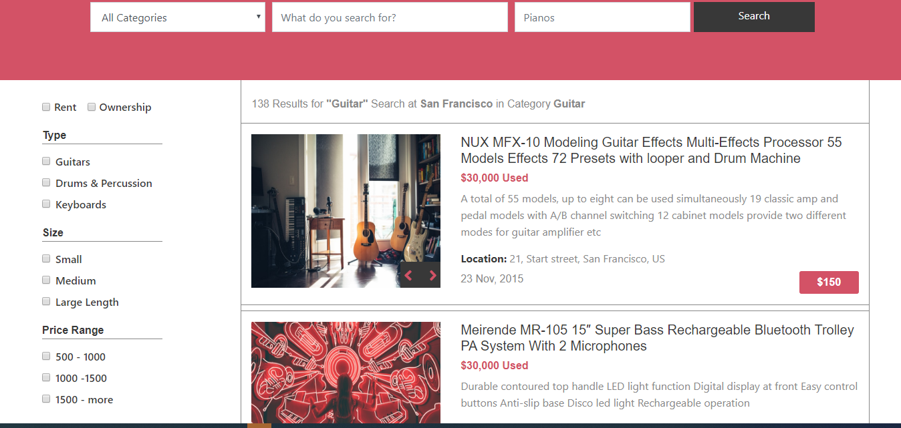

# Capstone Project
This is an HTML &amp; CSS Capstone Project based on an online shop for electronics

This project shows the format of designing a responsive webpage using CSS3 flexbox, CSS3 media queries and bootstrap 4 classes which has in-built media queries with different breakpoints, for smaller devices, medium devices and large screen devices. It is set up with the latest design and development standards, this project is developed mobile which rightly makes the page responsive. It also shows a combination of typography and colors. 
This is a personalized project after scrolling the prototype design of the online shop for elctronics by ZATTIX. I came up with this creatively personaliaed version. 
 

## Built With

- HTML5, Bootstrap 4, CSS3
- vscode

## Live Demo

[Live Demo Link](https://rawcdn.githack.com/okikiola11/capstone-project/ce8e61dc4a1a620a2d63cea0b5e9e3356b32e51a/index.html)

## Getting Started

To get a local copy up and running follow these simple example steps.

### Prerequisites
- Web browser
- Code editor
- Git and Github

### Usage
- Clone the project to your local machine 
- Open the index file in your browser

## Authors

- Okikiola Apelehin

👤 **Author1**

- Github: [okikiola apelehin](https://github.com/okikiola11)
- Twitter: [okikiola apelehin](https://twitter.com/Kikiolla3)
- Linkedin: [okikiola apelehin](https://www.linkedin.com/in/okikiola-apelehin-459008122/)

## 🤝 Contributing

Contributions, issues and feature requests are welcome!

Feel free to check the [issues page](https://github.com/okikiola11/capstone-project/issues).

## Show your support

Give a ⭐️ if you like this project!

## Acknowledgments

- Google
- Creative Commons

## 📝 License

This project is [MIT](lic.url) licensed.

